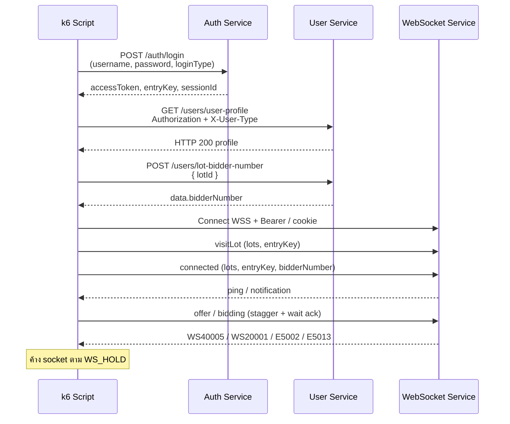

# k6 — Login → Visit Lot → Connected

เอกสารอธิบายสคริปต์ [`k6-login-visit-connected.js`](./k6-login-visit-connected.js)

## วัตถุประสงค์

ทดสอบ flow ของ Buyer ตั้งแต่ล็อกอินจนเข้าลานประมูลผ่าน WebSocket แล้วค้าง connection เพื่อส่ง `offer` / `bidding`

ลำดับที่ทดสอบ:

1. `POST /auth/login`
2. `GET /users/user-profile`
3. `POST /users/lot-bidder-number`
4. WebSocket `type=visitLot`
5. WebSocket `type=connected`
6. ช่วง hold: ส่ง `offer`/`bidding` แบบ stagger + รอ ack (default)

## แผนภาพลำดับงาน



## การตั้งค่า

### การรันแบบทุก VU พร้อมกัน + ค้าง connection (default)

- `VUS` default = `BUYER_USER.length`
- `USER_PICK=vu` → 1 VU : 1 buyer
- หลัง `visitLot` + `connected` สำเร็จ จะ **ค้าง WebSocket** ตาม `WS_HOLD` (default `5m`) และตอบ `ping`/`pong`
- ปิด socket เองเมื่อครบเวลา hold เท่านั้น (หรือ join fail)

```bash
k6 run k6-login-visit-connected.js \
  -e BASE_URL=https://auctlive-sit.auct.co.th/api/v1 \
  -e WS_URL=wss://auctlive-sit.auct.co.th/api/v1/websocket \
  -e LOT_ID=975 \
  -e WS_HOLD=10m
  
```

ค้างสั้น ๆ เพื่อทดสอบ:

```bash
-e WS_HOLD=60s
```

ซ้ำรอบต่อ VU (จะ hold ทุกรอบ):

```bash
-e ITERATIONS=3 -e WS_HOLD=2m
```

โหมด soak (`constant`):

```bash
-e EXECUTOR=constant -e DURATION=10m -e VUS=8 -e WS_HOLD=9m
```

> หมายเหตุ: ถ้า `EXECUTOR=constant` และ `ITERATIONS` หลายรอบ แต่ละรอบจะ login/connect ใหม่ — สำหรับ “ค้างทุกคนไว้ในระบบ” แนะนำ `per-vu` + `ITERATIONS=1` + `WS_HOLD` ยาวพอ
### บัญชีผู้ใช้ (`BUYER_USER` list)

แก้ในไฟล์สคริปต์เป็น **array**:

```js
export const BUYER_USER = [
  { username: 'donbuyer01', password: 'P@ssw0rd08', loginType: 'buyer' },
  { username: 'donbuyer02', password: 'P@ssw0rd', loginType: 'buyer' },
  // ...
];
```

การเลือก user ต่อ iteration:

| `USER_PICK` | สูตร | พฤติกรรม |
| --- | --- | --- |
| `vu` (default) | `(__VU - 1) % n` | VU เดียวใช้ user เดิมตลอด (แนะนำตอน parallel) |
| `round` | `(__VU - 1 + __ITER) % n` | หมุนเวียนทุก iteration |

ใช้กับ:

- body ของ `/auth/login`
- header `X-User-Type`
- cookie ชื่อ `{loginType}_session_id`
- query `userType` ของ WebSocket URL

### Environment ตอนรัน

| ตัวแปร | จำเป็น | ค่าเริ่มต้น | ความหมาย |
| --- | --- | --- | --- |
| `LOT_ID` | ใช่ | — | ลานประมูลที่ใช้กับ `lot-bidder-number` และ WS `lots` |
| `BASE_URL` | ไม่ | `https://auctlive-sit.auct.co.th/api/v1` | HTTP API gateway |
| `WS_URL` | ไม่ | `wss://auctlive-sit.auct.co.th/api/v1/websocket` | WebSocket endpoint |
| `VUS` | ไม่ | `BUYER_USER.length` | จำนวน VU ขนาน |
| `ITERATIONS` | ไม่ | `1` | รอบต่อ VU (`per-vu-iterations`) |
| `EXECUTOR` | ไม่ | `per-vu` | `per-vu` หรือ `constant` |
| `DURATION` | ไม่ | `30s` | ใช้เมื่อ `EXECUTOR=constant` |
| `USER_PICK` | ไม่ | `vu` | `vu` หรือ `round` |
| `WS_TIMEOUT_MS` | ไม่ | `15000` | ปิด WS ถ้ายังไม่ settle ภายในเวลานี้ |
| `JOIN_SETTLE_MS` | ไม่ | `1000` | รอหลังส่ง `connected` ก่อนถือว่าสำเร็จ |
| `LOG_WS_MSG` | ไม่ | `false` | `true` = log ข้อความ WS ที่รับเข้า (ยกเว้น ping) |
| `OFFER` | ไม่ | `true` | `false` = ค้าง WS อย่างเดียว ไม่ส่ง offer/bidding |
| `ACK` | ไม่ | `true` | รอ notification ก่อนยิงรอบถัดไป (กัน E5002 รัว) |
| `STAGGER_MS` | ไม่ | `250` | delay ของ VU n = `(n-1) * STAGGER_MS` เมื่อ `ACK=true` |
| `ACK_TIMEOUT_MS` | ไม่ | `2000` | รอ ack นานสุดต่อ 1 ข้อความ |
| `ACK_RETRY_MS` | ไม่ | `400` | รอหลัง E5002 / timeout ก่อนยิงใหม่ |
| `ACK_COOLDOWN_MS` | ไม่ | `800` | รอหลังสำเร็จ ก่อนยิง bidding รอบถัดไป |
| `BID_AFTER_OFFER` | ไม่ | `true` | หลัง `WS40005` หรือ `E5013` สลับเป็น `bidding` |
| `OFFER_INTERVAL_MS` | ไม่ | `1000` | ใช้เมื่อ `ACK=false` — ยิง offer ซ้ำแบบ sync ทุก VU |
| `REPORT_DIR` | ไม่ | `k6-reports` | root ของรายงาน |
| `REPORT_BASENAME` | ไม่ | `login-visit-connected` | ชื่อไฟล์ไม่รวมนามสกุล |
| `REPORT_JSON` | ไม่ | auto | override path JSON เต็ม |
| `REPORT_HTML` | ไม่ | auto | override path HTML เต็ม |
| `REPORT_TITLE` | ไม่ | `k6 login → visitLot → connected` | ชื่อหัวรายงาน HTML |

## วิธีรัน

```bash
k6 run k6-login-visit-connected.js \
  -e BASE_URL=https://auctlive-sit.auct.co.th/api/v1 \
  -e WS_URL=wss://auctlive-sit.auct.co.th/api/v1/websocket \
  -e LOT_ID=975
```

จะเห็น log พร้อมกันหลาย VU เช่น `vu=1`…`vu=8` ทำ login/profile/WS พร้อมกัน

Default (`ACK=true`) จะ stagger ตาม VU แล้วรอ notification ก่อนยิง offer/bidding รอบถัดไป

```bash
# โหมดปลอดภัย (default): stagger 250ms + รอ ack
k6 run k6-login-visit-connected.js -e LOT_ID=975 -e WS_HOLD=5m

# โหมดเดิม: ทุก VU ยิง offer พร้อมกันทุก 1s (ใช้ทดสอบ lock / E5002)
k6 run k6-login-visit-connected.js -e LOT_ID=975 -e ACK=false -e OFFER_INTERVAL_MS=1000
```

## Logging

แต่ละ action จะพิมพ์ `[INFO][vu=…][iter=…]` เช่น:

- `iteration.start` / `pickBuyer` / `iteration.done`
- `login.start` → `login.ok` (mask token/entryKey)
- `user-profile.start` → `user-profile.ok`
- `lot-bidder-number.start` → `lot-bidder-number.ok` (แสดง `bidderNumber`)
- `ws.connect.start` → `ws.open` → `ws.visitLot.send` → `ws.connected.send` → `ws.hold.start`
- `ws.ack.loop.start` / `ws.offer.send` / `ws.bidding.send` / `ws.ack.ok` / `ws.ack.retry` / `ws.ack.timeout`
- fail ใช้ `[ERROR]…` และ `iteration.abort`

เปิด log ข้อความ WS ที่รับเข้า:

```bash
-e LOG_WS_MSG=true
```

## Report (JSON + HTML)

Logic รายงานแยกไว้ที่ [`lib/k6-report.js`](./lib/k6-report.js) แล้ว import ผ่าน `createHandleSummary`.

หลังเทสจบจะเขียนไฟล์แบบ:

```text
k6-reports/
  └── yyyyMMdd/          # เช่น 20260813
      └── HH-mm-ss/      # เช่น 06-08-15
          ├── login-visit-connected.json
          └── login-visit-connected.html
```

Title ใน HTML/JSON:

`{REPORT_TITLE} — yyyy/MM/dd HH:mm:ss`

Reuse ในสคริปต์อื่น:

```js
import { createHandleSummary } from './lib/k6-report.js';

export const handleSummary = createHandleSummary(() => ({
  titleBase: 'my scenario',
  reportBasename: 'my-scenario',
  meta: { lotId: LOT_ID },
}));
```

เปลี่ยน root / ชื่อไฟล์:

```bash
-e REPORT_DIR=k6-reports \
-e REPORT_BASENAME=login-visit-connected \
-e REPORT_TITLE='SIT hold WS buyers'
```

หรือกำหนด path เต็มเอง:

```bash
-e REPORT_JSON=./out/result.json \
-e REPORT_HTML=./out/result.html
```

## รายละเอียดแต่ละขั้น

### 1. Login — `POST /auth/login`

- ส่ง `username`, `password`, `loginType` จาก `BUYER_USER`
- ตรวจว่าได้ HTTP 200 และมี `accessToken`, `entryKey`
- คืนค่า session: `{ accessToken, entryKey, sessionId }`
- ถ้า fail (เช่น `E2001 user not found`) จะ log แล้ว**ข้าม iteration** ไม่ยิงขั้นถัดไป

### 2. User profile — `GET /users/user-profile`

- ใส่ `Authorization: Bearer <accessToken>`
- ใส่ `X-User-Type: buyer` และ `X-Service-Name: user-service`
- ตรวจ HTTP 200 และมี `data`

### 3. Lot bidder number — `POST /users/lot-bidder-number`

- body: `{ lotId: <LOT_ID> }`
- ดึง `data.bidderNumber` ไปใช้กับ WS `connected`
- ถ้าไม่มี `bidderNumber` จะ fail / ข้ามขั้น WS

### 4. WebSocket — `visitLot` แล้ว `connected`

1. เปิด WSS:  
   `{WS_URL}?userType=buyer&service=websocket-service`
2. ส่ง headers: Bearer token, `X-User-Type`, และ cookie `{loginType}_session_id`
3. เมื่อ `open`:
   - ส่ง `visitLot` พร้อม `lots` + `entryKey` (เข้าชมลาน)
   - ส่ง `connected` พร้อม `lots` + `entryKey` + `bidderNumber` (เข้าร่วมลาน)
4. ตอบ `ping` ด้วย `pong`
5. ถ้าได้ notification error (`level=error`, `WS00043`, connected incorrectly) ระหว่าง join → นับ fail แล้วปิด
6. ถ้าไม่มี error ภายใน `JOIN_SETTLE_MS` → นับ `connected_ok` แล้ว**ค้าง socket** ตาม `WS_HOLD`
7. ช่วง hold (default `ACK=true`): ส่ง `offer`/`bidding` ทีละข้อความ รอ ack ก่อนยิงต่อ โดย VU n หน่วง `(n-1)*STAGGER_MS`
8. ถ้าเกิน `WS_TIMEOUT_MS` ยัง join ไม่สำเร็จ → นับ fail

## Metrics / Thresholds

| Metric | ประเภท | ความหมาย |
| --- | --- | --- |
| `login_duration_ms` | Trend | เวลา login |
| `user_profile_duration_ms` | Trend | เวลาเรียก profile |
| `lot_bidder_number_duration_ms` | Trend | เวลาเรียก bidder number |
| `ws_session_duration_ms` | Trend | เวลาทั้ง session WS |
| `visit_lot_ok` | Counter | ส่ง `visitLot` สำเร็จ |
| `connected_ok` | Counter | settle `connected` สำเร็จ |
| `connected_fail` | Counter | join/connected ล้มเหลวหรือ timeout |
| `ws_offer_sent` | Counter | จำนวน `offer` ที่ส่ง |
| `ws_bidding_sent` | Counter | จำนวน `bidding` ที่ส่ง |
| `ws_ack_ok` | Counter | ได้ ack สำเร็จ (`WS40005` / `WS20001`) |
| `ws_ack_retry` | Counter | ได้ E5002/E5013 แล้วรอ retry |
| `ws_ack_timeout` | Counter | ส่งแล้วไม่ได้รับ ack ภายใน `ACK_TIMEOUT_MS` |

Threshold หลัก:

- `http_req_failed < 10%`
- `checks > 90%`
- p95 ของ login / profile / lot-bidder-number `< 5000ms`

## ข้อควรรู้

- สคริปต์นี้**ไม่**ยิง `POST /datahub/product/collateral`
- Default จะส่ง `offer` แล้วสลับเป็น `bidding` หลังได้ `WS40005` หรือ `E5013` (`BID_AFTER_OFFER=true`)
- `ACK=false` คือโหมดเดิมที่ยิง offer พร้อมกันทุก VU — คาดว่าจะเห็น E5002
- `LOT_ID` ต้องเป็นลานที่มีอยู่จริง และบัญชี buyer ต้องมีสิทธิ์/ลงทะเบียนจนได้ `bidderNumber`
- ถ้า login ได้ `E2001` แสดงว่า username/`loginType` ไม่ตรงกับ user บน environment นั้น — แก้ที่ `BUYER_USER`
- Gateway ต้อง map JWT/cookie เป็น `X-Auth-User-Id` / `X-Auth-User-Type` สำหรับ `/users/*` และ WebSocket
